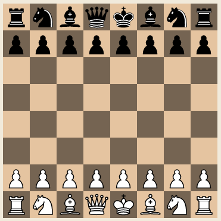

# game of chess
A basic game of chess made with javascript

## todo

 * basic mechanics like restarting a game or choosing sides in the beginning
 * special rules: castling, en passant, promotion
 * proper AI
 * move logging
 * check, checkmate
 * highlighting of previous field
 * animations
 * decoupling of easeljs
